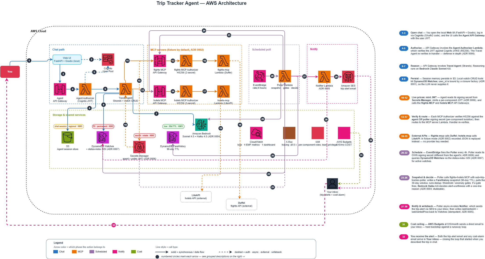
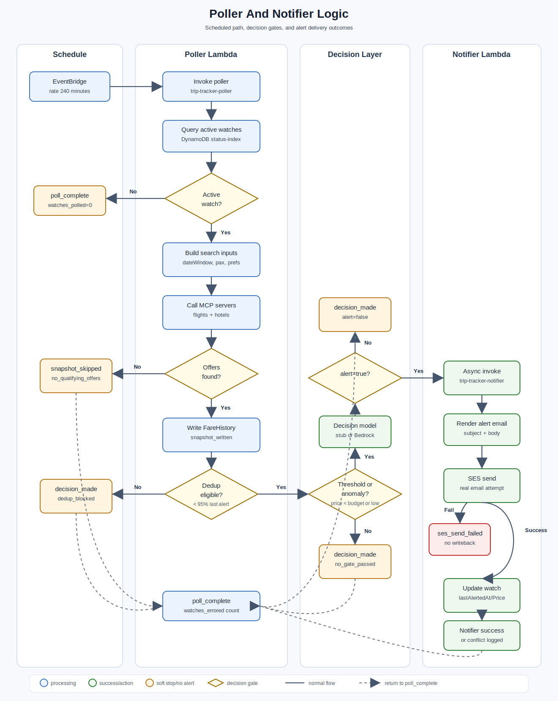

# Trip Tracker Agent

A personal trip-price tracker built as a user-aware AI agent on AWS
Lambda. You describe a candidate trip in chat — origin, destination,
date window, nights, budget — and the agent stores it as a *watch*. A
scheduled poller checks flight and hotel prices every few hours,
persists the **combined** flight + hotel cost over time, and emails you
when the total crosses your threshold or drops to an anomaly low
relative to recent history. Every alert carries a model-generated
explanation of why it is worth your attention.

No mainstream tool tracks the *combined* flight + hotel cost of a
specific candidate trip over time. This does. It is a single-user
personal project; the architecture is multi-tenant only because the
underlying scaffold is.

Canonical design: [`docs/superpowers/specs/2026-05-08-trip-tracker-agent-design.md`](./docs/superpowers/specs/2026-05-08-trip-tracker-agent-design.md).
Decisions: [`docs/adr/README.md`](./docs/adr/README.md). Threat model:
[`docs/threat-model.md`](./docs/threat-model.md).

## What the agent does

- **Natural-language watch creation** — "watching Tokyo in October, 5
  nights, leaving SFO, flexible ±3 days, max $1500 total" becomes a
  structured watch, no form.
- **Natural-language refinement** — "tighten Tokyo to weekends only"
  patches the existing watch.
- **Alert-worthiness reasoning** — not just "below threshold" but "below
  threshold *or* meaningfully cheaper than the 30-day median," decided
  by Bedrock with a written justification per alert (ADR 0004).
- **Status summarization** — "what's happening with my watches?"
  returns a per-watch one-line trend, not raw rows.

Search and alert only — no booking in v1. Alerts link out to the
airline/OTA.

## Architecture



Architecture source: [`trip-tracker-architecture.drawio`](./docs/diagrams/trip-tracker-architecture.drawio).

```
You ──chat──> Web UI (Cognito-gated) ──JWT──> API Gateway
                                                 │
                                    ┌────────────┴───────────┐
                                    ▼                         ▼
                          Travel Agent Lambda          (per-component JWT)
                          Strands + Bedrock                   │
                          watch CRUD tools                     ▼
                                    │                 flights-mcp (Duffel)
                                    ▼                 hotels-mcp  (LiteAPI)
                          Watches + FareHistory  <────────────┘
                          DynamoDB (status GSI)
                                    ▲
   EventBridge schedule ──> Poller Lambda ──> MCP price fetch ──> snapshot
                                    │            ──> threshold + anomaly gates
                                    │            ──> Bedrock decision (ADR 0004)
                                    ▼
                          Notifier Lambda ──> SES email (ADR 0005)
```

Complete architecture — every AWS service, all 8 Lambdas with their tools,
both data flows, and the trust boundaries — lives in the diagram:
[`docs/diagrams/trip-tracker-architecture.drawio`](./docs/diagrams/trip-tracker-architecture.drawio)
(rendered PNG: [`trip-tracker-architecture.png`](./docs/diagrams/trip-tracker-architecture.png)).
For the per-component rationale see [`docs/DESIGN.md`](./docs/DESIGN.md); for
user flows and sequence diagrams see [`docs/SYSTEM.md`](./docs/SYSTEM.md);
for trust boundaries see [`docs/threat-model.md`](./docs/threat-model.md).

**Poller and notifier flow**



For the full system guide — personas, user stories, user flows, and
end-to-end sequence diagrams — see
[`docs/SYSTEM.md`](./docs/SYSTEM.md). For the design rationale of every
component (constraints, alternatives rejected, tradeoffs) see
[`docs/DESIGN.md`](./docs/DESIGN.md).

**Components**

| Path | Role |
|------|------|
| `lambdas/travel-agent` | Strands chat agent; watch CRUD as local tools |
| `lambdas/agent-authorizer` | API Gateway authorizer — validates Cognito user JWTs |
| `lambdas/mcp-authorizer` | API Gateway authorizer — validates per-component JWTs (ADR 0006) |
| `lambdas/flights-mcp` | MCP server wrapping Duffel; fixture-replayable (ADR 0002) |
| `lambdas/hotels-mcp` | MCP server wrapping LiteAPI; fixture-replayable |
| `lambdas/poller` | Scheduled price poll → snapshot → gates → decision |
| `lambdas/notifier` | SES alert send + idempotent dedup writeback (ADR 0005) |
| `lib/data-stores.js` | `Watches` + `FareHistory` tables; `status-index` GSI (ADR 0007) |
| `lib/secrets.js` | Per-component JWT signing secrets in Secrets Manager (ADR 0006) |
| `lib/observability-dashboard.js` | CloudWatch dashboard across the Lambdas + APIs |
| `lib/budget-alarm.js` | Account-level $10/mo cost budget with email alerts |

### Authentication and authorization

- The chat agent is gated by [Amazon Cognito](https://aws.amazon.com/cognito/);
  `cdk deploy` provisions two demo users (`Alice`, `Bob`).
- The chat agent expects a JWT issued by Cognito whose subject is the
  user, validated against Cognito JWKS in the agent authorizer.
- The MCP servers expect a JWT minted per calling component (the chat
  agent and the poller each sign with their **own** Secrets Manager
  secret — ADR 0006), validated by the MCP authorizer.
- User identity is never inferred from an LLM response. It is always
  propagated as a JWT claim.

### Fixture vs live

Provider search can run in **fixture mode** and the poller decision can
run in **Bedrock stub mode** for deterministic rehearsal. The notifier
does not have an SES stub mode: when a notification is triggered, it
attempts a real SES email send. The MCP servers default to fixture mode;
Bedrock and SES default to live for production deploys. Pass
`-c bedrockMode=stub` for a poller-decision dry run (see Configure
below). The test suite mocks external sends/calls where needed.

## Running the project

Arm64 by default for cost efficiency; change the architecture in the
IaC if you need x86.

### Prerequisites

- AWS CLI, Git, Docker
- AWS CDK, Node.js
- For live Bedrock: access to the configured model (default
  `claude-haiku-4-5-20251001`) in your deploy region

### Install

```bash
npm install
(cd lambdas/agent-authorizer && npm install)
(cd lambdas/mcp-authorizer && npm install)
(cd lambdas/flights-mcp && npm install)
(cd lambdas/hotels-mcp && npm install)
```

### Configure

All configuration is supplied as CDK *context* (there is no runtime
`.env`). Copy [`.env.example`](./.env.example) to `.env` to keep your
values handy, then expand them onto the deploy command. A fixture/stub
deploy needs **no** external API keys:

```bash
# Fixture rehearsal - MCP fixture responses and poller Bedrock stub.
# If a notification is triggered, the notifier attempts a real SES email send.
# notifierSenderEmail/notifierRecipientEmail are required and must be SES-
# verified as needed for your account sandbox state.
# The agent's own Bedrock model is NOT stubbed — enable model access for
# the agent model in your deploy region (see Prerequisites) or the first
# chat returns AccessDeniedException.
cdk deploy -c bedrockMode=stub \
           -c notifierSenderEmail=you@example.com \
           -c notifierRecipientEmail=you@example.com

# Full live deploy — real flight/hotel prices, real Bedrock call, real SES:
cdk deploy -c mcpMode=live -c duffelApiKey=… -c liteApiKey=… \
           -c bedrockMode=live \
           -c notifierSenderEmail=… -c notifierRecipientEmail=…
```

Review the IAM changes CDK prints before approving. The SES sender
identity must be verified out of band (AWS console) before a live send;
new accounts are in the SES sandbox until you request production access.

### Post-deploy and web UI

```bash
./prep-web.sh          # sets demo-user passwords, writes web/.env
cd web
python3 -m venv .venv && source .venv/bin/activate
pip install -r requirements.txt
python app.py          # http://localhost:8000/chat/
```

Log in via the Cognito-hosted screen as `Alice` or `Bob` (password set
by `prep-web.sh`), then talk to the agent:

- "Watch a trip to Tokyo in October, 5 nights from SFO, max $1500 total"
- "Tighten that to weekends only"
- "What's happening with my watches?"

### Clean up

```bash
cdk destroy
```

## Testing

```bash
npm test                                        # CDK construct tests (jest)
# Python Lambdas use the shared test venv; run per package:
cd lambdas/poller   && ../../.venv-tests/Scripts/python.exe -m pytest tests/ -q
cd lambdas/notifier && ../../.venv-tests/Scripts/python.exe -m pytest tests/ -q
```

Construct synth tests skip Docker bundling via the
`aws:cdk:bundling-stacks: []` context.

GitHub Actions ([`.github/workflows/ci.yml`](./.github/workflows/ci.yml))
runs the same suites on every push and pull request: the CDK construct
tests, the MCP-server / authorizer Node suites, and the Python Lambda +
evals suites against the pinned [`requirements-test.txt`](./requirements-test.txt).

## License

MIT — see [LICENSE](./LICENSE).
