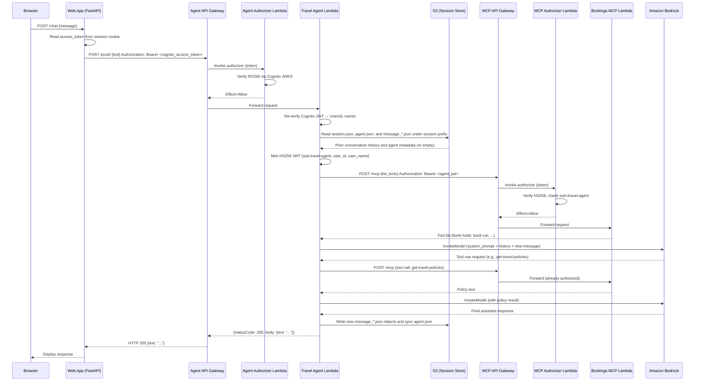
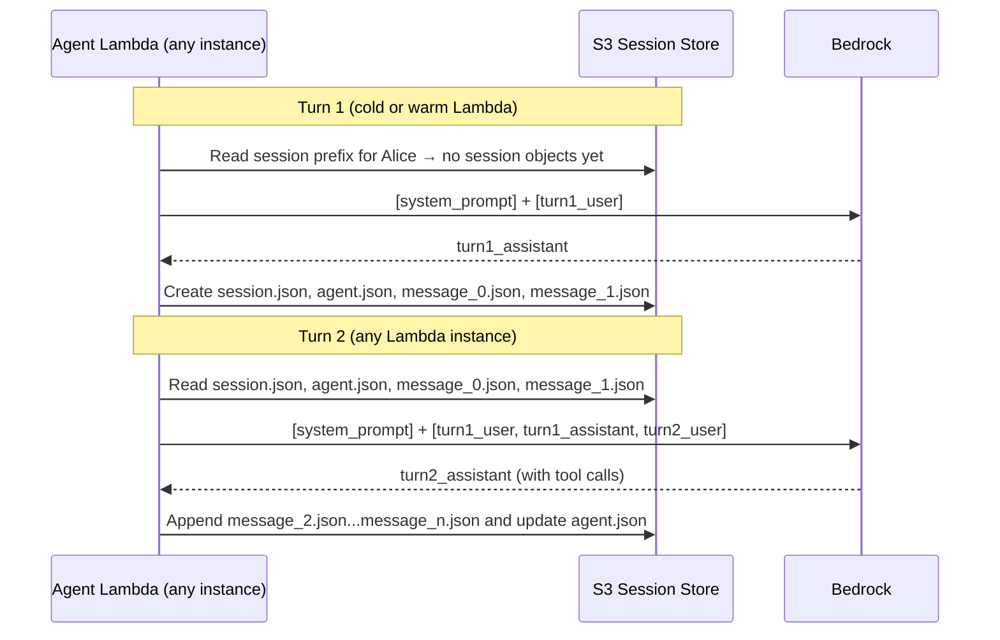
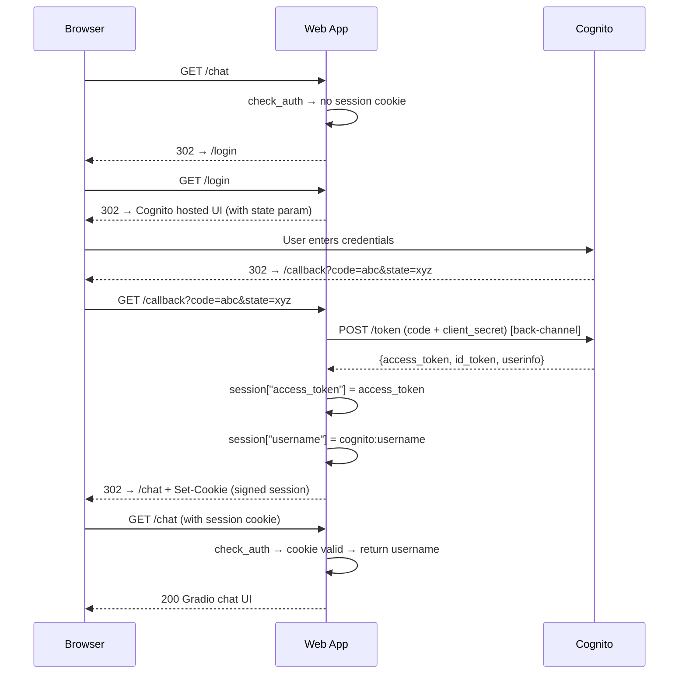
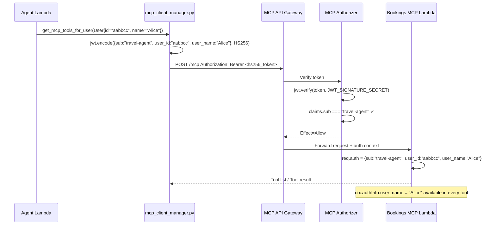

# Session and State Management Analysis
## `strands-agent-on-lambda`

> Analysis date: 2026-05-08  
> Codebase snapshot: all files under `lambdas/`, `web/`, and `lib/`

---

## Table of Contents

1. [Architecture Overview](#1-architecture-overview)
2. [Conversation / Session State](#2-conversation--session-state)
3. [User State Across Lambda Invocations](#3-user-state-across-lambda-invocations)
4. [Storage Mechanisms](#4-storage-mechanisms)
5. [MCP Server Tool State](#5-mcp-server-tool-state)
6. [Travel Agent Context and Memory Between Turns](#6-travel-agent-context-and-memory-between-turns)
7. [OAuth / Auth Token Storage and Refresh](#7-oauth--auth-token-storage-and-refresh)
8. [Caching Layers](#8-caching-layers)
9. [End-to-End Multi-Turn Walkthrough](#9-end-to-end-multi-turn-walkthrough)
10. [Sequence Diagrams](#10-sequence-diagrams)
11. [Stateful vs Stateless Classification](#11-stateful-vs-stateless-classification)
12. [Limitations and Trade-offs](#12-limitations-and-trade-offs)

---

## 1. Architecture Overview

The system is composed of four independently deployed units:

| Unit | Runtime | Purpose |
|---|---|---|
| **Web app** (`web/`) | FastAPI + Gradio container | Browser UI, OAuth2 login flow |
| **Agent Lambda** (`lambdas/travel-agent/`) | Python 3.13 / Strands SDK | LLM orchestration, session load/save |
| **MCP Server Lambda** (`lambdas/bookings-mcp/`) | Node 22 / Express + MCP SDK | Booking tools, travel policy enforcement |
| **Cognito** | AWS managed | User pool, OIDC IdP |

Infrastructure is provisioned by CDK (`lib/`) with the following state-related resources:

```
S3 Bucket (AgentSessionStore)  ← conversation history
API Gateway (AgentApi)         ← stateless HTTPS endpoint
API Gateway (McpApi)           ← stateless HTTPS endpoint
Cognito User Pool              ← identity / token issuance
```

---

## 2. Conversation / Session State

### Where it lives

Conversation history is stored in **Amazon S3** via the Strands SDK's `S3SessionManager`. There is **no DynamoDB, ElastiCache, or Redis** anywhere in this stack.

### Key code: `lambdas/travel-agent/agent.py`

```python
# agent.py – lines 52-56
session_manager = S3SessionManager(
    session_id=f"session_for_user_{user.id}",   # stable per-user key
    bucket=SESSION_STORE_BUCKET_NAME,
    prefix="agent_sessions"
)
```

The resulting S3 key is:

```
s3://<AgentSessionStore>/agent_sessions/session_session_for_user_<cognito_sub>/
```

The `session_id` is derived from `user.id`, which is the Cognito `sub` claim (a UUID-style opaque identifier). This key is **stable across user sessions and Lambda cold-starts** — the same S3 object is always used for a given user regardless of which Lambda execution environment handles the request.

The Strands SDK stores session data as multiple JSON objects under that prefix, not a single blob:

```
agent_sessions/
    session_session_for_user_<cognito_sub>/
        session.json
        agents/
            agent_travel_agent/
                agent.json
                messages/
                    message_0.json
                    message_1.json
                    ...
```

### How the Strands agent uses it

```python
# agent.py – lines 63-74
agent = Agent(
    model=model,
    agent_id="travel_agent",
    session_manager=session_manager,   # injected here
    system_prompt=system_prompt,
    callback_handler=None,
    tools=[tools] + mcp_tools,
)

agent_response = agent(composite_prompt)
```

This behavior is **automatic** once `session_manager=session_manager` is passed to `Agent(...)`.

The Strands Python SDK confirms this through its hook system:

- `Agent.__init__` attaches the session manager to the agent hook registry.
- `SessionManager.register_hooks(...)` subscribes to `AgentInitializedEvent`, `MessageAddedEvent`, and `AfterInvocationEvent`.
- On `AgentInitializedEvent`, the session manager calls `initialize(agent)`, which restores prior agent metadata and prior messages from storage when the session already exists.
- On every `MessageAddedEvent`, the session manager calls `append_message(...)` and then `sync_agent(...)`.
- On `AfterInvocationEvent`, the session manager calls `sync_agent(...)` again to persist any conversation-manager or agent-state updates made during the turn.

So the per-request flow is more precisely:

1. Lambda builds a new `Agent` and a new `S3SessionManager` for the stable per-user `session_id`.
2. During agent initialization, Strands emits `AgentInitializedEvent`, and the session manager restores any existing session from S3 into the new in-memory agent instance.
3. When `agent(composite_prompt)` runs, the user message is appended to `agent.messages`; Strands emits `MessageAddedEvent`, and that message is immediately persisted to S3.
4. The model runs with the restored `agent.messages` history plus the new user turn.
5. If the model performs tool use, assistant tool-use messages and tool-result messages are each appended to `agent.messages`; each append emits `MessageAddedEvent`, and each message is persisted.
6. When the final assistant response is appended, it is also persisted through `MessageAddedEvent`.
7. At the end of the invocation, Strands emits `AfterInvocationEvent`, and the session manager syncs the agent metadata again.

This means the project does **not** manually call load/save methods anywhere. The load/append/sync lifecycle is owned by Strands.

### Message format

The Strands SDK models conversation history as a list of messages in the format expected by the Bedrock Converse API. Each element records role (`user` / `assistant`), text content, and tool use or tool result blocks. This is the standard Anthropic/Bedrock conversational format.

---

## 3. User State Across Lambda Invocations

### Lambda is stateless by design

The Lambda handler (`app.py`) is explicitly documented as stateless:

```python
# app.py – design note
# Keep the Lambda stateless. Conversation memory lives behind agent.py via an
# external session manager, which makes this handler safe for retries,
# concurrency, and cold starts.
```

Each invocation:
1. Verifies the Cognito JWT independently.
2. Reconstructs the `User` object from JWT claims.
3. Creates a new `S3SessionManager` pointing at the user's S3 key.
4. Either reuses or creates an MCP client for that user (see §8).

### User identity object

```python
# user.py
class User:
    def __init__(self, id: str, name: str):
        self.id = id       # Cognito sub (UUID) — used as session key
        self.name = str    # Cognito username — forwarded to MCP tools
```

The `User` object is **ephemeral** — it is reconstructed on every request from the JWT and never persisted anywhere.

### User context injected into the LLM prompt

```python
# app.py – lines 58-62
composite_prompt = f"User name: {user.name}\n"
composite_prompt += f"User IP: {source_ip}\n"
composite_prompt += f"User prompt: {prompt_text}"
```

`User name` and `User IP` are prepended to every prompt so the LLM knows the caller's identity and location without needing to look it up from state. These values come from the verified JWT and API Gateway event respectively — not from anything the LLM said.

---

## 4. Storage Mechanisms

### S3 — Conversation history (only persistent store)

| Attribute | Value |
|---|---|
| Bucket | `AgentSessionStore` (CDK: `lib/agent.js` line 43) |
| Lifecycle | `RemovalPolicy.DESTROY` + `autoDeleteObjects: true` (dev/test convenience) |
| Key pattern | `agent_sessions/session_session_for_user_<user.id>/...` |
| Write permissions | Agent Lambda role only (`agentSessionStoreBucket.grantReadWrite(travelAgentFn)`) |
| Encryption | S3 default (SSE-S3 by default; no explicit KMS key configured) |

There is no explicit TTL or cleanup policy on session objects. They accumulate indefinitely until the bucket is deleted. In production, an S3 lifecycle rule should be added to expire old sessions.

### No DynamoDB

Despite `ddb` being imported in `lib/agent.js`:

```javascript
// lib/agent.js – line 5
const ddb = require('aws-cdk-lib/aws-dynamodb');   // (imported for potential future use)
```

…it is never used. **There is no DynamoDB table in this stack.**

### No ElastiCache / Redis

No caching infrastructure is provisioned. All caching is in-process (Lambda execution environment memory only).

### Web app session storage — signed cookie

```python
# web/app.py – line 30
fastapi_app.add_middleware(SessionMiddleware, secret_key="secret")
```

The web app stores `access_token` and `username` in a Starlette `SessionMiddleware` cookie. The cookie is **signed** (HMAC-SHA256) with `secret_key` to prevent tampering, but is **not encrypted** — the contents are base64-visible to anyone with the cookie. For a demo this is acceptable; in production the secret should be rotated and stored securely.

---

## 5. MCP Server Tool State

### The MCP server is fully stateless

From `lambdas/bookings-mcp/transport.js`:

```javascript
// transport.js – lines 16-20
const newMcpServer = mcpServer.create();
const transport = new StreamableHTTPServerTransport({
    // This is a stateless MCP server, so we don't need to keep track of sessions
    sessionIdGenerator: undefined,
    enableJsonResponse: true,
});
```

A **new `McpServer` instance and a new `StreamableHTTPServerTransport` are created for every single HTTP request**. Nothing is retained between calls. The `sessionIdGenerator: undefined` setting explicitly opts out of any MCP session tracking.

### Tool implementations

All four tools are pure functions with no side effects on shared state:

| Tool | File | State accessed |
|---|---|---|
| `book-hotel` | `tool-book-hotel.js` | `ctx.authInfo.user_name` only (from JWT claim) |
| `book-car` | `tool-book-car.js` | `ctx.authInfo.user_name`, hard-coded `CARS` array |
| `get-available-cars` | `tool-get-available-cars.js` | `ctx.authInfo.user_name` only |
| `get-travel-policies` | `tool-get-travel-policies.js` | `ctx.authInfo.user_name` only |

The `CARS` array in `tool-book-car.js` is a module-level constant — it is read-only, not mutated, so it is effectively stateless:

```javascript
// tool-book-car.js
const CARS = ["Toyota Corolla", "Honda CRV", "Mercedes C300"]
```

**No booking data is written to any database.** The tools return confirmation strings but do not persist anything. This is a demo limitation — a production system would need a backend booking store.

### User identity in tools

Every tool reads user identity from `ctx.authInfo`, which is populated from the JWT injected by `bookings-mcp/index.js`:

```javascript
// index.js – lines 21-26
const claims = jwt.verify(jwtString, JWT_SIGNATURE_SECRET);
req.auth = claims;   // makes claims available as ctx.authInfo inside tools
```

The `user_id` and `user_name` claims travel from:

```
Cognito JWT (RS256)
  ↓ verified in agent-authorizer/index.js
  ↓ re-parsed in travel-agent/app.py → User object
  ↓ encoded into new HS256 JWT in mcp_client_manager.py
  ↓ verified in mcp-authorizer/index.js
  ↓ stored on req.auth in bookings-mcp/index.js
  ↓ available as ctx.authInfo in every tool handler
```

---

## 6. Travel Agent Context and Memory Between Turns

### What the agent remembers

The Strands `S3SessionManager` persists the **full message history** of the conversation as individual message objects plus agent/session metadata. On the next turn, a fresh `Agent(...)` is constructed, and Strands restores those messages during `AgentInitializedEvent` before the new request is processed. This means the agent remembers:

- Everything the user has typed in prior turns.
- Every response it has given.
- All tool calls it has made and their results (tool use blocks in the conversation thread).

### What the agent does NOT remember across cold starts (without S3)

Without the `S3SessionManager`, each Lambda invocation would start fresh with an empty conversation — the agent would have no memory of prior turns. The S3 backend is what makes the experience feel conversational.

### System prompt as persistent context

```python
# agent_config.py
system_prompt="""You are an enterprise travel agent for AcmeCorp. Your job is to help
employees book business travel that complies with company policies...
When a user requests travel, always check whether the request contains all necessary
details... Before making any travel arrangements, check if the request complies with
AcmeCorp's travel policies...
"""
```

The system prompt is **re-injected on every invocation** — it is not stored in S3. It acts as persistent behavioral context that guides the LLM regardless of what is in the conversation history.

### Tool discovery and re-use

```python
# mcp_client_manager.py – lines 74-79
# Return cached tools if this user's client was already set up
if user.id in mcp_tools and user.id in mcp_clients:
    l.info(f"existing mcp client/tools found for user.id={user.id}")
    return mcp_tools[user.id]
```

On the first turn for a user in a warm Lambda, the Strands agent calls `list_tools_sync()` to discover MCP tools dynamically. On subsequent turns (same warm execution environment), the tool list is served from the in-memory `mcp_tools` dict. This means the agent's awareness of available tools is:

- **First call (warm):** loaded from MCP server via HTTP
- **Subsequent calls (same warm env):** served from memory
- **Cold start:** always re-fetches from MCP server

---

## 7. OAuth / Auth Token Storage and Refresh

### Token types in the system

| Token | Type | Algorithm | Issued by | Used for |
|---|---|---|---|---|
| Cognito access token | JWT | RS256 | Cognito | Web app → Agent API authorization |
| Cognito ID token | JWT | RS256 | Cognito | Available at callback but not forwarded |
| Agent → MCP JWT | JWT | HS256 | `mcp_client_manager.py` | Agent → MCP API authorization |

### Web app: where the Cognito token is stored

```python
# web/oauth.py – /callback route
req.session["access_token"] = access_token
req.session["username"] = username
```

The Cognito access token is stored in the **Starlette session cookie**. It is:
- Set once after a successful OAuth2 callback.
- Read on every chat message and forwarded to the Agent API as a Bearer token.
- Cleared on `/logout`.

### Token validity

Configured in `lib/cognito.js`:

```javascript
// cognito.js – lines 26-27
accessTokenValidity: Duration.hours(8),
idTokenValidity: Duration.hours(8)
```

Access tokens are valid for **8 hours**. There is **no token refresh mechanism** implemented in the web app. Once the 8-hour access token expires:
1. The cookie still contains the expired token.
2. The next chat message will fail with HTTP 401/403 from the Agent API.
3. The UI surfaces this as `"Agent returned authorization error. Try to re-login."` (see `web/app.py`).
4. The user must manually click Logout and log back in.

There is no silent refresh, no refresh token storage, and no proactive expiry check.

### Agent-to-MCP token: no expiry, no rotation

```python
# mcp_client_manager.py – lines 85-91
token = jwt.encode({
    "sub": "travel-agent",
    "user_id": user.id,
    "user_name": user.name,
}, jwt_signature_secret, algorithm="HS256")
```

The JWT minted by `mcp_client_manager.py` has **no `exp` claim** — it never expires. It is cached in the Lambda execution environment memory alongside the MCP client. If the `JWT_SIGNATURE_SECRET` is rotated, the cached tokens will become invalid and the next MCP call will fail with 401 (which triggers a new token + client on retry or cold start).

### Logout flow

```python
# web/oauth.py – /logout route
req.session.clear()
logout_url = f"{COGNITO_LOGOUT_URL}&logout_uri={REDIRECT_AFTER_LOGOUT_URL}"
return RedirectResponse(url=logout_url)
```

Logout clears the local session cookie **and** redirects to the Cognito logout endpoint, terminating the Cognito SSO session. This is a proper double-logout pattern that prevents the user from silently re-authenticating.

---

## 8. Caching Layers

### Layer 1: API Gateway authorizer cache (implicit)

API Gateway's `TokenAuthorizer` caches IAM policy decisions for a period (default 300 seconds / 5 minutes). This means:
- A valid token is not re-verified against Cognito JWKS on every request.
- A revoked token may continue to pass the authorizer for up to 5 minutes.

No explicit TTL override is set in the CDK constructs.

### Layer 2: JWKS client key cache (in-memory, Lambda env)

```javascript
// agent-authorizer/index.js – lines 18-21
const client = jwksClient({
    jwksUri: COGNITO_JWKS_URL,
    cache: true   // ← keys are cached in memory
});
```

The `jwks-rsa` library caches public keys in memory. This avoids a Cognito HTTPS round trip on every authorization decision. Key entries are refreshed when the `kid` in the JWT header is not found in the cache (i.e., Cognito has rotated keys).

### Layer 3: MCP client + tool list cache (in-memory, Lambda env, per user)

```python
# mcp_client_manager.py – module level
mcp_tools = {}    # dict[user_id → list[MCPTool]]
mcp_clients = {}  # dict[user_id → MCPClient]
```

These module-level dicts survive across warm invocations of the same Lambda execution environment. The cache has:
- **No TTL**
- **No invalidation mechanism**
- **No size limit**

The comment in `mcp_client_manager.py` thoroughly documents the trade-offs and four strategies for handling cache staleness (bump TOOLS_VERSION env var, add TTL, re-fetch every request, or use MCP change notifications).

### Layer 4: PyJWKClient key cache (in-memory, Lambda env)

```python
# app.py – module level
jwks_client = jwt.PyJWKClient(COGNITO_JWKS_URL)
```

The `PyJWKClient` is instantiated at **module load time** (outside the handler), so it survives warm Lambda invocations. It caches Cognito's public signing keys automatically. This is the recommended pattern for `python-jose` / PyJWT to avoid per-request HTTPS calls.

### Summary of caching

| Cache | Location | Scope | TTL | Invalidation |
|---|---|---|---|---|
| Cognito JWKS public keys | Lambda process memory (Node) | Per Lambda env | Until key `kid` missing | Automatic on `kid` miss |
| Cognito JWKS public keys | Lambda process memory (Python) | Per Lambda env | Implicit (library-managed) | Automatic |
| API Gateway authorizer decisions | API Gateway cache | Per token | ~5 min (default) | Token expiry |
| MCP client + tool list | Lambda process memory | Per user × per Lambda env | None | Cold start only |
| Web session (access_token) | Browser signed cookie | Per browser | 8-hour token expiry | Manual logout / token expiry |

---

## 9. End-to-End Multi-Turn Walkthrough

### Scenario: Alice books a hotel over two turns

#### Setup

Alice's Cognito `sub` = `"aabbcc-1234-..."`, username = `"Alice"`.

---

#### Turn 0: Login

1. Alice's browser hits `GET /chat` → `check_auth` finds no session cookie → raises `HTTPException(302)` → browser redirects to `/login`.
2. `/login` builds the Cognito hosted-UI URL with `state` parameter and redirects.
3. Alice enters credentials on Cognito's domain.
4. Cognito redirects to `/callback?code=abc123&state=...`.
5. Web app exchanges code for tokens via back-channel POST to Cognito token endpoint.
6. Tokens returned: `access_token` (RS256, 8-hour validity), `userinfo` with `cognito:username = "Alice"`.
7. Web app stores `{ "access_token": "eyJ...", "username": "Alice" }` in signed session cookie.
8. Browser redirects to `/chat`, Gradio loads, greeting displayed.

**State after Turn 0:**
- Browser cookie: `{ access_token, username }`
- S3: nothing yet
- Lambda memory: nothing yet

---

#### Turn 1: "I need to travel to New York"

1. Alice types "I need to travel to New York" → Gradio calls `chat()` in `web/app.py`.
2. `chat()` reads `token` from `request.request.session["access_token"]`.
3. `httpx.post(AGENT_ENDPOINT_URL, headers={"Authorization": f"Bearer {token}"}, json={"text": "I need to travel to New York"})`.

**At API Gateway (Agent):**

4. `TokenAuthorizer` extracts `Bearer eyJ...`, invokes `agent-authorizer/index.js`.
5. Authorizer fetches signing key from JWKS cache (or Cognito if cold), verifies RS256 signature, extracts `sub` and `username`.
6. Returns `Effect=Allow` with `principalId="aabbcc-1234-...|Alice"`.
7. API Gateway forwards request to `travel-agent` Lambda.

**Inside `travel-agent/app.py`:**

8. `get_jwt_claims()` re-parses the JWT using `PyJWKClient` (module-level singleton). Extracts `sub="aabbcc-1234-..."`, `username="Alice"`.
9. Constructs `User(id="aabbcc-1234-...", name="Alice")`.
10. Builds composite prompt:
    ```
    User name: Alice
    User IP: 70.200.50.45
    User prompt: I need to travel to New York
    ```
11. Calls `agent.prompt(user, composite_prompt)`.

**Inside `agent.py`:**

12. Creates `S3SessionManager(session_id="session_for_user_aabbcc-1234-...", bucket="...", prefix="agent_sessions")`.
13. During `AgentInitializedEvent`, Strands checks S3 under `agent_sessions/session_session_for_user_aabbcc-1234-.../`. On the first turn there is no `session.json` / `agent.json` / `messages/` data yet, so the session starts empty.
14. Calls `mcp_client_manager.get_mcp_tools_for_user(user)`.
    - `mcp_clients["aabbcc-1234-..."]` not found → mints HS256 JWT with `{sub: "travel-agent", user_id: "aabbcc-1234-...", user_name: "Alice"}`.
    - Creates `MCPClient` with `Authorization: Bearer <hs256_token>`.
    - `mcp_client.start()` → connects to MCP API Gateway.
    - `mcp_client.list_tools_sync()` POSTs an MCP `tools/list` request.
    
    **At API Gateway (MCP):**
    - `mcp-authorizer/index.js` verifies HS256 token, checks `sub === "travel-agent"` → `Effect=Allow`.
    - `bookings-mcp/index.js` re-verifies JWT, stores claims on `req.auth`.
    - `transport.js` creates a new `McpServer` + `StreamableHTTPServerTransport`.
    - Returns tool list: `[book-hotel, book-car, get-available-cars, get-travel-policies]`.
    
    - Stores in `mcp_tools["aabbcc-1234-..."]` and `mcp_clients["aabbcc-1234-..."]`.
15. Constructs `Agent(model=BedrockModel("claude-3-5-haiku"), session_manager=s3_session_manager, tools=[tools_module, book-hotel, book-car, ...])`.
16. Calls `agent("User name: Alice\nUser IP: 70.200.50.45\nUser prompt: I need to travel to New York")`.
17. Strands loads session from S3 → empty → sends conversation to Bedrock with system prompt + user turn.
18. Claude responds: "Hi Alice! I'd be happy to help you plan your business trip to New York. Before I proceed, could you confirm: your departure city, travel dates, purpose of the trip, and any preferences?"
19. Strands persists the turn incrementally: it creates session metadata objects and writes message objects such as `.../messages/message_0.json` and `.../messages/message_1.json`, then syncs `agent.json` again at the end of the invocation.
20. Returns response text.

**Back to web app:**

21. `response_text = "Hi Alice! ..."` → Gradio renders it in the chat.

**State after Turn 1:**
- Browser cookie: unchanged
- S3: `agent_sessions/session_session_for_user_aabbcc-1234-.../` now contains `session.json`, `agents/agent_travel_agent/agent.json`, and per-message objects for the user and assistant turns
- Lambda memory: `mcp_tools["aabbcc-1234-..."]` = 4 tools, `mcp_clients["aabbcc-1234-..."]` = live MCPClient

---

#### Turn 2: "I'm flying from Seattle, June 10-12, for a sales meeting"

1. Alice submits the follow-up message.
2. Steps 2–11 identical to Turn 1 (stateless Lambda boundary).

**Inside `agent.py`:**

3. New `S3SessionManager` created (same session_id). During `AgentInitializedEvent`, Strands reads `session.json`, `agent.json`, and the prior `messages/message_*.json` objects, then restores the prior 2 messages into the in-memory agent.
4. `mcp_client_manager.get_mcp_tools_for_user(user)`:
   - `"aabbcc-1234-..."` IS in `mcp_tools` → returns cached tool list immediately (no MCP HTTP call).
5. `Agent` constructed with prior conversation loaded.
6. Bedrock receives: system prompt + prior [user, assistant] turns + new user turn.
7. Claude calls `get-travel-policies` tool first (per system prompt instructions).
   
   **MCP tool call:**
   - Strands sends MCP `tools/call` for `get-travel-policies`.
   - MCP transport creates new `McpServer` + transport per request.
   - Tool handler reads `ctx.authInfo.user_name = "Alice"` (from cached HS256 JWT on the live MCPClient).
   - Returns: "Here are the travel policies for Alice: 1. US only. 2. No luxury cars. 3. Max 5 days. 4. Business only."
   
8. Claude verifies: Seattle→New York, 3 days, sales meeting ✓ all compliant.
9. Claude calls `book-hotel` with `{city: "New York", date: "2026-06-10", nights: 2}`.
   
   **MCP tool call:**
   - `tool-book-hotel.js` reads `ctx.authInfo.user_name = "Alice"`.
   - Returns: "Booked hotel in New York for Alice for 2 nights. Check-in date is 2026-06-10."
   
10. Claude calls `book-car` with `{city: "New York", date: "2026-06-10", days: 2, category: 0}`.
    - Returns: "Booked a Toyota Corolla for Alice in New York for 2 days starting 2026-06-10."
    
11. Claude final response: "I've completed your booking, Alice! Here's the summary: [hotel + car details]."
12. Strands appends the new assistant/tool/tool-result messages as additional `message_*.json` objects and syncs `agent.json` again after invocation.
13. Returns response text.

**State after Turn 2:**
- S3: 6+ messages in session (user×2, assistant×2, tool calls, tool results)
- Lambda memory: same cached tools + client (if same execution env)
- No booking data persisted anywhere (tools return strings only)

---

## 10. Sequence Diagrams

### Overall system flow (single turn)



### Multi-turn conversation state flow



### OAuth2 login flow



### Token exchange at the agent↔MCP boundary



---

## 11. Stateful vs Stateless Classification

### Fully stateless components

| Component | Why stateless |
|---|---|
| `app.py` (Lambda handler) | Reconstructs all state from JWT + S3 on every call |
| `agent-authorizer/index.js` | Verifies JWT; no writes; cached decisions are in API GW, not the Lambda |
| `mcp-authorizer/index.js` | Verifies JWT; no writes |
| MCP server per-request `McpServer` | New instance per HTTP request; no session tracking |
| MCP tool handlers | Pure functions; read `ctx.authInfo` only; no side effects |
| `User` object | Reconstructed from JWT every invocation; never persisted |

### Stateful components (in-memory, ephemeral)

| Component | State | Lifetime | Risk |
|---|---|---|---|
| `mcp_clients` dict in `mcp_client_manager.py` | Live MCP HTTP connections per user | Warm Lambda env lifetime (minutes to hours) | Stale connections; stale tool list |
| `mcp_tools` dict in `mcp_client_manager.py` | Tool list per user | Warm Lambda env lifetime | Stale if MCP server updated |
| `jwks_client` in `app.py` | Cognito public keys | Warm Lambda env lifetime | Auto-refreshed on key rotation |
| `client` in `agent-authorizer/index.js` | Cognito public keys | Warm Lambda env lifetime | Auto-refreshed on key rotation |

### Stateful components (durable, external)

| Component | State | Storage | Lifetime |
|---|---|---|---|
| Strands `S3SessionManager` | Full conversation history | S3 | Indefinite (no TTL) |
| Web session cookie | `access_token` + `username` | Browser | Until logout or browser close |
| Cognito User Pool | User accounts, hashed passwords | AWS managed | Until pool deleted |

---

## 12. Limitations and Trade-offs

### 1. No token refresh → 8-hour hard session limit

The Cognito access token has an 8-hour validity, and there is no refresh token flow. After expiry, the user gets an error message and must re-login manually. A production implementation should store the Cognito refresh token in the session and silently exchange it for a new access token before making agent calls.

### 2. No MCP tool cache TTL → potential stale tool discovery

If the MCP server adds a new tool, existing warm Lambda instances will not discover it until they cold-start. The code documents four strategies (TOOLS_VERSION env var bump, TTL, re-fetch every request, MCP change notifications). None are implemented — the choice is left to deployers.

### 3. No conversation session TTL → unbounded S3 growth

Session objects in S3 accumulate indefinitely. Long-running deployments will accumulate sessions for every user who has ever used the system. An S3 object lifecycle rule (e.g., expire after 30 days of no modification) should be added.

### 4. No booking persistence → demo only

`book-hotel`, `book-car`, and `get-available-cars` return hardcoded confirmation strings and do not write to any backend. A production system would need a real booking database and idempotency on booking requests.

### 5. Hardcoded JWT_SIGNATURE_SECRET → security risk

The HS256 shared secret defaults to `"jwt-signature-secret"` hardcoded in `lib/strands-agent-on-lambda-stack.js`. This is the same for every deployment unless overridden. In production this must be stored in AWS Secrets Manager and loaded at Lambda startup.

### 6. Web session `secret_key="secret"` → security risk

The Starlette `SessionMiddleware` uses a fixed key to sign cookies. Anyone with access to the web app source code can forge or read session cookies.

### 7. Per-execution-environment MCP client cache → not shared across instances

If the Agent Lambda scales to N concurrent execution environments, each has its own `mcp_clients` and `mcp_tools` dict. The N-th cold start will always incur a `list_tools_sync()` round-trip regardless of how many other warm instances exist. This is not a correctness issue but is a latency consideration under load.

### 8. Double JWT verification on the MCP path → redundant but harmless

Both API Gateway (via `mcp-authorizer`) and the Express middleware (`bookings-mcp/index.js`) verify the HS256 JWT. This is documented as intentional defense-in-depth but means a JWT decoding error at the application layer would return a different status code format than the API Gateway layer would.

### 9. User context injected via prompt, not tool call → potential for prompt injection

The composite prompt includes `User name` and `User IP` as plain text prepended to the user's message:

```python
composite_prompt = f"User name: {user.name}\n"
composite_prompt += f"User IP: {source_ip}\n"
composite_prompt += f"User prompt: {prompt_text}"
```

If `user.name` is controlled by the attacker (e.g., a crafted Cognito username), it could inject text into the model prompt. However, `user.name` comes from the verified Cognito JWT, so it is only as controllable as the user's ability to register with Cognito (`selfSignUpEnabled: false` limits this to admin-created accounts). The risk is low but should be documented.

### 10. No conversation isolation guarantee at S3 level

The session namespace is `session_for_user_<cognito_sub>`, stored in S3 as `session.json`, `agent.json`, and per-message objects under the corresponding prefix. If two browser tabs submit requests concurrently for the same user, both Lambda invocations will restore from the same session prefix and then write additional message objects based on what they each observed. Because this design does not document optimistic locking or compare-and-swap semantics in the application, concurrent turns can still produce ordering conflicts or inconsistent agent metadata. A production implementation should validate the library's conflict behavior under concurrent writes or add explicit versioning/locking around session updates.
