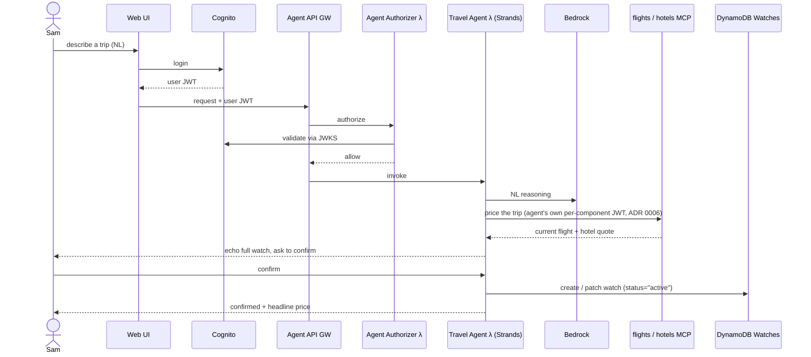
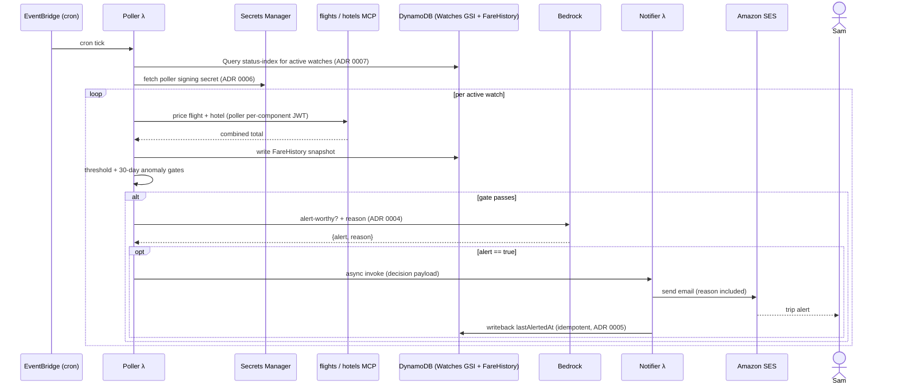

# Trip Tracker — System Guide

How the system works, who it is for, the user flows, and end-to-end
sequence diagrams. Pairs with:

- Architecture diagram (AWS icons): [`diagrams/trip-tracker-architecture.drawio`](./diagrams/trip-tracker-architecture.drawio) — rendered PNG alongside as [`trip-tracker-architecture.png`](./diagrams/trip-tracker-architecture.png)
- Canonical design: [`superpowers/specs/2026-05-08-trip-tracker-agent-design.md`](./superpowers/specs/2026-05-08-trip-tracker-agent-design.md)
- Decisions: [`adr/README.md`](./adr/README.md) · Threat model: [`threat-model.md`](./threat-model.md)
- Quickstart / deploy: [`../README.md`](../README.md)

---

## 1. What the system does

You describe a candidate trip in chat. The agent stores it as a
**watch**. A scheduled poller checks the **combined flight + hotel
cost** every few hours, persists it over time, and emails you when the
total crosses your threshold *or* drops to an anomaly low versus recent
history — each alert carrying a model-written reason. No mainstream tool
tracks the *combined* cost of a *specific* candidate trip over time;
this does. It is single-user by intent; multi-tenant only because the
underlying scaffold is.

Two independent paths:

- **Chat path** — natural-language watch create / refine / status /
  live-price, gated by Cognito.
- **Scheduled path** — EventBridge → poll prices → decide
  alert-worthiness via Bedrock → email via SES.

---

## 2. Personas

### P1 — Sam, the deal-seeking traveler (primary, the only end user)

Plans trips months ahead, watches several candidate destinations at
once, and is price-sensitive on the **flight + hotel total**, not
either leg alone. Wants signal, not marketing email. Will not fill in
forms or learn a query syntax — talks in plain language ("watching
Tokyo in October, 5 nights from SFO, max $1500"). Acts on an alert by
clicking through to the airline/OTA to book (the system never books).

### P2 — The operator (you, who deploys and runs it)

Owns the AWS account. Cares about: deploying at **zero cost** for a dry
run (fixture/stub modes), a hard **$10/month** cost ceiling with email
warning, per-component credential isolation, and one dashboard to see
health. Not a 24/7 on-call; the system must fail safe and self-heal.

---

## 3. User stories

**Sam**

- So I don't refresh flight sites daily, I want to describe a trip once
  and have it tracked automatically.
- So I track what I actually pay, I want the **combined** flight +
  hotel total, not separate alerts.
- So I'm not spammed, I want an email **only** when the total beats my
  threshold or is anomalously low — with a one-line reason I trust.
- So I can adjust without a form, I want to refine a watch in chat
  ("tighten Tokyo to weekends only").
- So I stay oriented, I want "what's happening with my watches?" to
  return a one-line trend per watch, not raw data.
- So I can sanity-check now, I want "how much is Tokyo right now?" to
  give a headline number and a qualitative read.
- So I stay in control, I want to pause, resume, or remove a watch by
  asking.

**Operator**

- So I can try it free, I want fixture/stub modes that need no API keys
  and make no paid calls.
- So a runaway loop can't bankrupt me, I want a $10/mo budget alarm.
- So a single leaked credential is contained, I want the agent and the
  poller to sign with **separate** secrets ([ADR 0006](./adr/0006-per-component-jwt-secrets.md)).
- So I can see health at a glance, I want one CloudWatch dashboard.

---

## 4. User flows

### 4.1 Create a watch (chat)

Sam: *"Watch Tokyo in October, 5 nights from SFO, max $1500 total."*
The agent asks for any missing field **one at a time**, may call the
flights/hotels MCP servers to price the trip now, echoes the full
structured watch back in plain English, and saves it only on explicit
confirmation. Nothing is silently inferred.

### 4.2 Refine a watch (chat)

*"Tighten Tokyo to weekends only."* The agent patches the existing
watch (same confirm-before-save rule). Status changes
(pause/resume/remove) are conversational and never drop the `status`
attribute (it is the poller's GSI key — [ADR 0007](./adr/0007-watches-status-gsi.md)).

### 4.3 Status check (chat)

*"What's happening with my watches?"* One headline line per watch —
destination, current total, trend vs recent history — details on
request. No raw rows.

### 4.4 Live price query (chat)

*"How much is Tokyo right now?"* The agent calls the flights/hotels MCP
servers (its **own** per-component JWT) and replies with a headline
number plus a qualitative read; offers to convert to a watch if none
exists. No write.

### 4.5 Receive an alert (scheduled, no user action)

The poller finds the tracked total has crossed the threshold or hit an
anomaly low; Bedrock confirms it is alert-worthy and writes the reason;
the notifier emails Sam once (idempotent — [ADR 0005](./adr/0005-after-ses-idempotency.md)).
Sam clicks through to book externally.

---

## 5. Sequence diagrams

### 5.1 Watch creation (chat path)



### 5.2 Scheduled poll and alert



### 5.3 Live price query (chat path, no write)

```mermaid
sequenceDiagram
    actor Sam
    participant Agent as Travel Agent λ
    participant MCP as flights / hotels MCP
    Sam->>Agent: "how much is Tokyo right now?"
    Agent->>MCP: search flights + hotels (agent per-component JWT)
    MCP-->>Agent: current totals
    Agent-->>Sam: headline number + qualitative read; offer to make a watch
```

---

## 6. Component responsibilities

| Component | Responsibility |
|-----------|----------------|
| Web UI (`web/`) | Cognito-gated chat front end |
| Cognito | User identity; issues the user JWT; provides JWKS |
| Agent API Gateway + Agent Authorizer λ | Validate the Cognito user JWT before the agent runs |
| Travel Agent λ (`lambdas/travel-agent`) | Strands agent; **local** watch-CRUD tools + **MCP** flight/hotel tools; Bedrock for reasoning; S3 for session |
| flights-mcp / hotels-mcp λ | Domain MCP servers wrapping Duffel / LiteAPI; fixture-replayable ([ADR 0002](./adr/0002-fixture-replay-mode.md)) |
| MCP Authorizer λ (per server) | Validate the **per-component** JWT (agent's or poller's) |
| Secrets Manager (`lib/secrets.js`) | Separate signing secrets for agent vs poller ([ADR 0006](./adr/0006-per-component-jwt-secrets.md)) |
| DynamoDB Watches | Watches; `status-index` GSI so the poller Queries, not Scans ([ADR 0007](./adr/0007-watches-status-gsi.md)) |
| DynamoDB FareHistory | Per-watch price snapshots; 90-day TTL |
| EventBridge + Poller λ | Cron enumeration → price fetch → snapshot → gates → decision |
| Bedrock (Claude Haiku 4.5) | Alert-worthiness decision + written reason ([ADR 0004](./adr/0004-bedrock-decision.md)) |
| Notifier λ + SES | One idempotent alert email + `lastAlertedAt` writeback ([ADR 0005](./adr/0005-after-ses-idempotency.md)) |
| CloudWatch dashboard | 8 Lambdas + 3 APIs + poller EMF counters |
| AWS Budgets | $10/mo ceiling → email |

---

## 7. Trust and identity (why two JWTs)

User identity is **never** inferred from an LLM response — it rides a
JWT claim end to end. The Cognito user JWT gates the chat agent. The
chat agent and the poller each call the same MCP servers but sign with
**different** secrets ([ADR 0006](./adr/0006-per-component-jwt-secrets.md)):
a leaked agent secret cannot mint poller-claiming tokens or vice versa,
and the MCP authorizers reject the wrong signer. This is the security
reason the diagram shows two separate per-component JWT edges into the
MCP servers.

---

## 8. Modes and cost posture

`mcpMode` defaults to **fixture** (recorded API responses, no keys).
`bedrockMode` and `sesMode` default to **live** for production deploys —
pass `-c bedrockMode=stub -c sesMode=stub` for a fully cost-free dry run
(see [`../README.md`](../README.md) → Configure). The whole test suite
always runs fixture/stub. The $10/mo AWS Budget alarm is the backstop
against a runaway poll loop.
