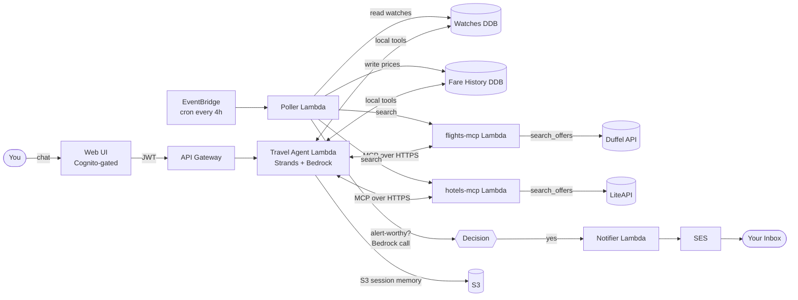
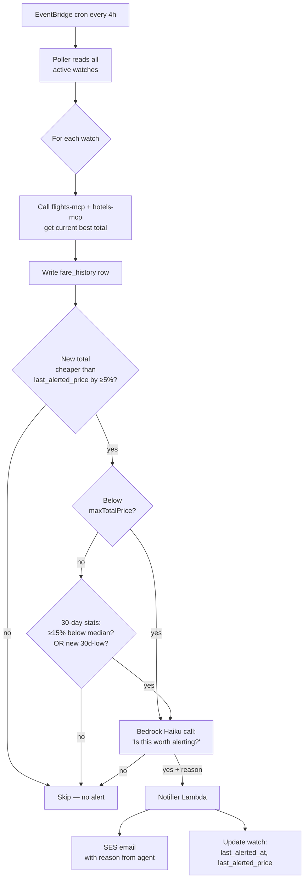

# Trip Tracker Agent — Design Spec

**Date:** 2026-05-08
**Status:** Approved (brainstorming complete; ready for implementation planning)
**Owner:** Isabel
**Repo basis:** `sample-serverless-mcp-servers/strands-agent-on-lambda` (existing Strands + Bedrock + Lambda + Cognito + MCP scaffold)

---

## 1. Problem & differentiator

### The personal problem
The user constantly searches for cheap flights and hotels but finds it hard to **track prices over time** for the trips they're considering — especially the **combined flight + hotel cost**, which is what actually matters as a buyer.

### The market reality
Existing tools (Google Flights, Hopper, Going, Kayak, Booking.com) cover slices of this:
- Google Flights tracks **flights** well, but not hotels.
- Hotels.com / Booking.com send marketing emails, not real per-listing alerts.
- **No mainstream tool tracks the combined flight + hotel cost** of a candidate trip over time.

### The differentiator (v1)
A **trip tracker agent**: the user describes a candidate trip in chat (origin, destination, date window, nights, budget). The agent stores it as a watch, polls Duffel (flights) + LiteAPI (hotels) every few hours, persists the combined trip price over time, and emails the user when the total crosses a threshold *or* hits an anomaly low relative to recent history. Each alert includes a model-generated explanation of *why* it's worth attention.

### Why this is more than a cron job
The agent is responsible for:
1. **Natural-language watch creation** — converting "watching Tokyo in October, 5 nights, leaving SFO, flexible ±3 days, max $1500 total" into a structured watch with no UI form.
2. **Natural-language refinement** — "tighten Tokyo to weekends only" → patch the watch.
3. **Alert worthiness reasoning** — going beyond "below threshold" to "below threshold *or* meaningfully cheaper than 30-day median," with a written justification per alert.
4. **Status summarization** — "what's happening with my watches?" returns a per-watch one-line summary with trend, not raw data.

### What this is NOT trying to be
Not a Booking.com replacement. Not a public service. Not a multi-user product (the user is the only intended user, though the architecture supports multi-tenancy because that's what the scaffold provides). Not a booking system in v1 (search + alert only; user clicks a deep link to book on the airline/OTA).

---

## 2. Architecture

### What's reused from the existing repo
- Agent-on-Lambda pattern (Strands + Bedrock)
- Cognito JWT auth + custom Lambda authorizer
- S3 session manager for multi-turn conversation state
- MCP server pattern (one server per external integration)
- Web UI shell

### What's new
- Two DynamoDB tables (`Watches`, `FareHistory`)
- EventBridge schedule + Poller Lambda
- Notifier Lambda + SES
- Two replacement MCP servers: `flights-mcp` (wraps Duffel), `hotels-mcp` (wraps LiteAPI)
- Local tools added to the Travel Agent Lambda for watch CRUD

### What's removed
- The travel-domain stub data and the demo "agent-to-agent" flow if not used

### High-level diagram



### Deliberate boundaries
- **MCP servers are isolated per provider.** Changing Duffel doesn't touch LiteAPI. Each MCP server is a separately-deployable Lambda with its own IAM role and secrets.
- **Watch CRUD is local tools, not MCP.** Internal data ops on tables in the same trust boundary as the agent — no need for the MCP transport overhead. Mirrors the existing `tools.py` pattern.
- **Poller and chat agent share the same MCP servers.** One integration point per provider, used in two contexts. Avoids drift between "what the agent sees" and "what the cron sees."

---

## 3. Data model

Two DynamoDB tables, on-demand billing.

### `Watches` table
- **Partition key:** `userId` (Cognito `sub`)
- **Sort key:** `watchId` (uuid)

| Field | Type | Notes |
|---|---|---|
| `userId` | string | Cognito `sub` |
| `watchId` | string | uuid |
| `type` | string | `"specific"` (v1); `"opportunity"` reserved for v1.5 |
| `origin` | string \| string[] | Airport code or list (e.g., `["SFO","OAK","SJC"]`) |
| `destination` | string | City name (e.g., `"Tokyo"`); expanded to airports inside `flights-mcp` |
| `dateWindow` | object | `{earliestDepart, latestDepart, nights: int \| {min,max}}` |
| `pax` | int | Passenger count |
| `maxTotalPrice` | number | USD threshold for the simple alert path |
| `alertStrategy` | string | `"threshold" \| "anomaly" \| "both"` (default `"both"`); `"both"` = OR (either gate can trigger the agent decision) |
| `preferences` | object | `{maxStops, hotelMinStars, prefAirlines, redEyeOk, ...}` |
| `status` | string | `"active" \| "paused" \| "archived"` |
| `lastAlertedAt` | string \| null | ISO timestamp (anti-spam) |
| `lastAlertedPrice` | number \| null | USD (anti-spam) |
| `createdAt` | string | ISO timestamp |
| `updatedAt` | string | ISO timestamp |

### `FareHistory` table
- **Partition key:** `watchId`
- **Sort key:** `timestamp` (ISO; query descending for latest-first)

| Field | Type | Notes |
|---|---|---|
| `watchId` | string | FK to Watches |
| `timestamp` | string | ISO |
| `flightPrice` | number | USD |
| `hotelPrice` | number | USD |
| `totalPrice` | number | USD; what we threshold and rank against |
| `bestOfferBlob` | object | Denormalized snapshot: `{airline, flightNumber, stops, departDate, returnDate, hotelName, checkin, checkout, bookingDeepLink}` |
| `duffelRequestId` | string | For debugging |
| `liteApiRequestId` | string | For debugging |
| `ttl` | number | Unix epoch, 90 days from `timestamp` (DDB TTL) |

### Schema decisions worth flagging
- **`destination` is a city, not an airport.** Airport expansion happens at search time inside `flights-mcp`. This is a chat-UX concession: the user shouldn't have to know HND vs NRT.
- **`bestOfferBlob` is denormalized.** Yes, it duplicates data also held inside Duffel/LiteAPI. But it lets the alert email say *"Lowest in 30 days: $1420 — AA non-stop on Oct 17, Park Hotel Tokyo"* without re-querying providers. Cheap storage; fast reads; simpler poller.
- **`lastAlertedAt` + `lastAlertedPrice` live on the watch.** Enables the anti-spam dedup gate in §5 — don't re-alert if the new price isn't meaningfully lower than the last alert.
- **`status: "paused"` is supported.** Cheaper than delete/recreate; lets the user mute a watch during an active trip.
- **TTL on fare history at 90 days.** Long enough for "is this a 30-day low?" reasoning, short enough that storage cost stays trivial.

---

## 4. Agent tools & chat patterns

### Tool surface

**Local tools (in-process, in `travel-agent/tools.py`):**

| Tool | Purpose |
|---|---|
| `add_watch(origin, destination, dateWindow, nights, pax, maxTotalPrice, preferences)` | Create a watch from chat |
| `list_watches()` | Return user's active watches with latest price snapshot |
| `update_watch(watchId, **patches)` | Patch fields (e.g., "tighten to weekends only") |
| `pause_watch(watchId)` / `resume_watch(watchId)` | Mute during an active trip |
| `remove_watch(watchId)` | Soft-delete (`status="archived"`) |
| `get_fare_history(watchId, limit=30)` | Price snapshots for trend display |
| `get_user_location(ip)` | Already in repo — keep |
| `get_todays_date()` | Already in repo — keep |

**MCP tools (separate Lambdas):**

| Server | Tool | Purpose |
|---|---|---|
| `flights-mcp` | `search_offers(origin, destination, departDate, returnDate, pax, maxStops?)` | Live Duffel search; top N offers |
| `flights-mcp` | `get_offer_details(offerId)` | Full fare rules + booking link |
| `hotels-mcp` | `search_offers(city, checkin, checkout, pax, minStars?)` | Live LiteAPI search |
| `hotels-mcp` | `get_hotel_details(hotelId)` | Amenities, photos, full rate breakdown |

### Five chat patterns (these are also the v1 eval set)

1. **Setup** — *"watch Tokyo trips for me"*
   Agent asks the missing pieces (origin, dates, nights, budget) one at a time, echoes the full watch back in plain English, asks to confirm, then calls `add_watch`. **No silent defaults.**

2. **Status** — *"what's happening with my watches?"*
   `list_watches` + recent `get_fare_history` per watch; reply leads with a one-line summary per watch ("Tokyo: $1480, near 30-day low, ↓$120 from last week"), then offers details on request.

3. **Live search** — *"how much is Tokyo right now?"*
   `search_offers` on both MCPs; reply with the headline number + qualitative read ("$1640 — about average for these dates"). Offers to convert to a watch.

4. **Refinement** — *"tighten Tokyo to weekends only"*
   `update_watch`. Confirms the change.

5. **Acting on an alert** — *"show me the details from that email"*
   Looks up the most recent fare history row, surfaces `bestOfferBlob` + booking deep link.

### System prompt direction

The system prompt (in `agent_config.py`) must enforce:
- Always ask follow-ups for missing info before creating a watch — never silent defaults.
- Always echo the full watch back in plain English before saving.
- On status checks, lead with the one-line summary per watch, then offer details.
- On live search, lead with the headline number and *why* it is or isn't a good price (using fare history if a comparable watch exists).
- Use `get_todays_date` whenever the user mentions relative dates ("next month", "this fall").
- Never invent prices, airlines, hotel names, or availability not present in tool responses.

### Model choice
- **Chat agent:** Claude Haiku 4.5 (`us.anthropic.claude-haiku-4-5-20251001-v1:0`). The chat-with-tool-calls pattern is well within Haiku's reasoning envelope and the cost discipline matches the personal/dev framing; the original spec called for Sonnet 4.6, revised after measuring Haiku 4.5 against the v1 chat patterns.
- **Alert decision (in poller):** Claude Haiku 4.5 (`claude-haiku-4-5-20251001`). The decision is small and bounded; Haiku is fast and cheap.

---

## 5. Polling & alert decision

### Cadence
EventBridge schedule fires the Poller Lambda **every 4 hours**. Configurable via CDK env var.

### Decision flow



### What each gate does
- **Cheaper-than-last-alerted gate (≥5% lower):** Anti-spam. Without this, a price that hovers just below threshold sends an email every 4 hours.
- **Threshold gate:** The simple "below `maxTotalPrice`" path. Fast.
- **Anomaly gate:** Catches the case where the user-stated threshold was too low and they'd otherwise miss a real opportunity. Triggers on ≥15% below 30-day median *or* a new 30-day low.
- **Bedrock decision call:** Final yes/no. Sees the new total, the 30-day price history, the watch criteria, and stored preferences. Returns `{alert: bool, reason: string}`. The reason is templated into the email.

### Why route through Bedrock at all
1. The `reason` line is the actual user value of the email. Generic "price dropped" notifications are why marketing emails get ignored. *Why* it's flagged is the trust-building part.
2. Lets soft preferences influence the decision ("I prefer non-stops" can affect whether a 1-stop fare is alert-worthy at a low price).
3. It's the agentic justification for using Bedrock at all in the background path — without this, the design is "scheduled DB query + SES."

### Cost bound
For 10 active watches polled every 4 hours, Bedrock is called only when both the dedup gate and either threshold/anomaly gate pass — roughly 2-3 calls per day. Under $0.01/day on Haiku 4.5.

### Idempotency
The `lastAlertedAt` + `lastAlertedPrice` write happens **after** SES confirms send. If the Lambda crashes between SES success and DDB write, the next poll may produce one duplicate email; the dedup gate catches it on the third poll. Acceptable for v1.

### Failure handling
- Per-watch errors (Duffel timeout, LiteAPI 5xx) are logged and skipped; the poller continues with the next watch. One bad watch never blocks the others.
- Poller-level errors (DDB unavailable, etc.) propagate as Lambda failure; EventBridge retries per its own policy.
- Each poll writes a CloudWatch metric for: watches polled, watches errored, alerts sent, Bedrock decisions made.

---

## 6. Evals

Three layers, lightest to heaviest:

| Layer | What it tests | How |
|---|---|---|
| **Unit** | MCP servers return correctly shaped data; local tools persist correctly | pytest, runs in CI |
| **Behavioral (LLM-as-judge)** | Each of the 5 chat patterns from §4 behaves correctly | Fixture set per pattern; Claude Sonnet 4.6 as judge scores responses against rubric |
| **Decision quality** | Alert worthiness call from §5 makes the right yes/no | Hand-labeled golden set of `(fare history, current price, watch criteria) → expected decision` |

### Repo layout
```
evals/
  fixtures/
    chat_setup/       # 5-10 watch-creation conversations
    chat_status/      # 5-10 status check exchanges
    chat_search/      # 5-10 live searches
    chat_refine/      # 5-10 watch updates
    chat_alert/       # 5-10 "show me alert details" cases
    decision/         # 30-50 hand-labeled alert worthiness cases
  judge_prompts/      # Rubric per pattern
  run_evals.py        # Local script — not deployed
  results/            # Timestamped run outputs (gitignored)
```

### Operational notes
- Evals are a **local script**, not a deployed Lambda. They run on-demand before pushing major prompt changes.
- Putting evals in CI is a v1.5 enhancement (requires Bedrock-on-CI cost discipline).
- Judge model: Claude Sonnet 4.6. Decision-quality evals can use Haiku 4.5 for the under-test call but Sonnet 4.6 as judge.

---

## 7. Cost estimate

Personal usage (the only user is the builder):

| Service | Cost/month |
|---|---|
| Bedrock Claude Haiku 4.5 (alert decisions) | ~$0.30 |
| Bedrock Claude Sonnet 4.6 (chat agent, light use) | ~$0.50 |
| Lambda (all functions) | free tier |
| DynamoDB on-demand | <$0.10 |
| EventBridge schedule | free |
| SES | free (62K/mo from Lambda) |
| API Gateway | <$0.10 |
| S3 (Strands sessions) | <$0.05 |
| Cognito | free (≤50K MAU) |
| CloudWatch logs | <$0.20 |
| **Total** | **~$1-3/month** |

**Mandatory:** AWS Budget alarm at $10/month with email notification. Cheap insurance against a runaway loop.

---

## 8. Out of scope for v1 (deferred)

| Item | Why deferred | When |
|---|---|---|
| Booking via Duffel | KYB onboarding, real money, refund flows | v2, after v1 has been used for a real trip planning cycle |
| Opportunity finder mode (multi-destination per watch) | More complex ranking + UX | v1.5, once v1 is stable |
| Calendar-aware trip suggester | Google Calendar OAuth | v2 — separate MCP server |
| SMS / Discord / Telegram notifications | Email works, adds infra | Per-channel, on demand |
| Multi-trip combinatorial planner | Complex search space | v2 |
| Public demo mode (chat or static) | User is the only intended user | Maybe never |
| Mobile app / native push | Email is fine on phone | Maybe never |
| Multi-user marketing/onboarding | Architecturally supported but not productized | If/when this stops being a personal tool |

---

## 9. Launch checklist

These ship at the same time as v1 but are not features:

- README with: 30-second pitch, architecture diagram (export Mermaid as PNG), screenshots, Loom link, deployment instructions, cost note
- 60-second Loom walkthrough — record one watch creation, one alert email, one "what's happening" status check
- AWS Budget alarm at $10/month
- CloudWatch dashboard with: poller success rate, last-poll timestamp per watch, Bedrock token usage, alert-send count
- One real watch active for 7 days before declaring "done" — gives a real trend to screenshot for the README

---

## 10. Open questions for implementation planning

These were deliberately deferred from brainstorming because they're better answered with code in front of you:

- **CDK structure:** add new constructs to the existing stack, or split into a second stack for the new pieces? (Lean toward one stack with clear file separation.)
- **Secret storage:** Duffel + LiteAPI keys in AWS Secrets Manager (consistent with patterns) or SSM Parameter Store (simpler for indie use)?
- **Poller concurrency:** sequential per-watch loop (simple) vs `asyncio.gather` (faster as watches grow)? Start sequential.
- **Bedrock cost cap:** add per-day token budget guard in the poller decision call?
- **Failed-MCP-call retry:** retry with backoff inside the poller, or fail-fast and rely on next cron tick?

These are good first items for the implementation plan.
